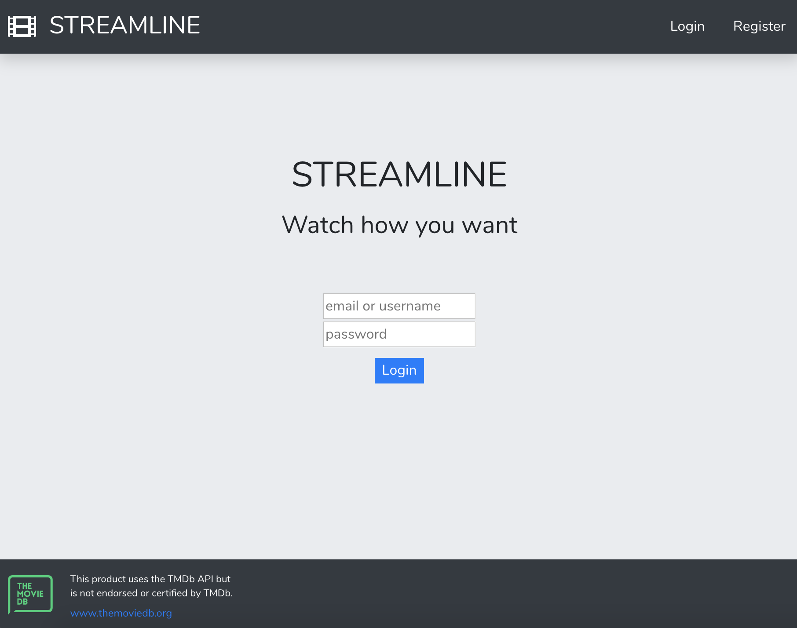
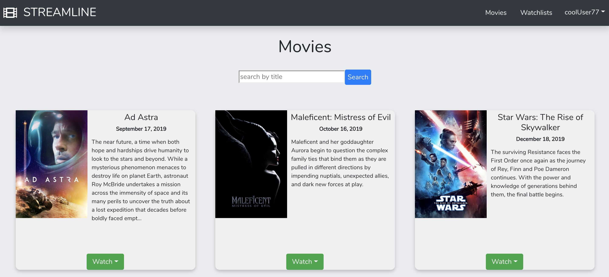
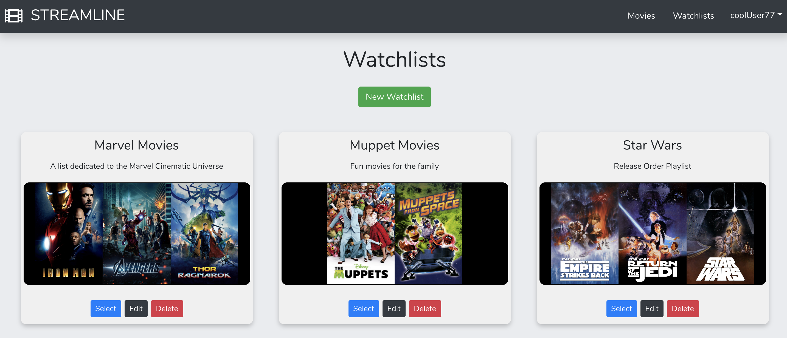
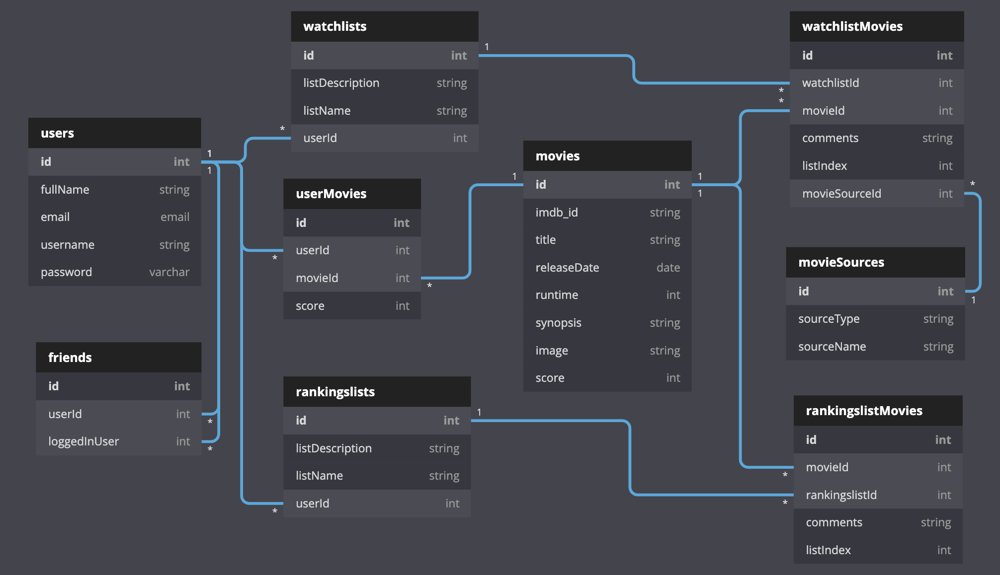

# STREAMLINE

## What is Streamline?

With the rise of different streaming platforms and physical media options, Streamline provides a way for users to keep track of all the movies they want to watch in one place. With Streamline, you can create custom watchlists, track where you want to view the movie, and add notes to each movie.

## Setup: Follow these instructions exactly

1. Clone this repository
1. `cd` into the directory it creates
1. In the `api` directory, create a copy of the `database.json.example` and remove the .example extension.
1. Run `npm install` and wait for all dependencies to be installed
1. Run `npm start` to verify that installation was successful.

## Running Your Server

1. Open another terminal window and navigate to the `api` folder within `src`
1. Run `json-server -p 5002 -w database.json`

## Using Streamline

1. In the browser, navigate to `localhost:3000`
1. If you are a returning user, `Login` with your account information

1. If you have never used Streamline before, click `Register` in the Navbar to go to the registration view and register for a new account
1. On the `Movies` view, search for a movie that you would like to watch.
2. To add a movie, select the `Watch` dropdown button on that movie card.
2. Either select a watchlist from the dropdown, or create a new watchlist to add the movie to a new watchlist.
1. On the `Watchlists` view, you can `Edit` or `Delete` any of your watchlists. You can click on `Select` to see the details view of a watchlist.
2. On the details view of a watchlist, select the `Watch On` dropdown menu to select an option of where you want to watch the movie.
2. On the details view of a watchlist, select the `Notes` button to add your own notes to that movie.

1. To logout, click on your `username` in the top right corner of the Nav Bar to see a dropdown menu and select `Logout`

## ERD

&copy;2019 - Ryan Crowley